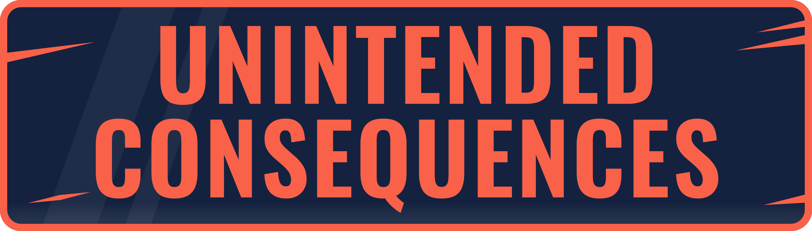
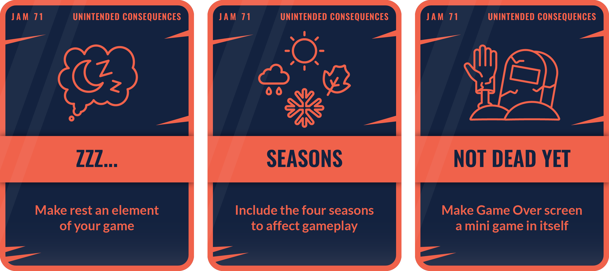

# Godot Wild Jam 71

Theme: Unintended consequences

Wildcards:

- [ ] ZZZ... (Make rest an element of your game)
- [ ] Seasons (Include the four seasons to affect gameplay)
- [ ] Not dead yet (Make Game Over screen a mini game in itself)

# About

Name: Unpredictable Chemistry

Genre: Puzzle

Game loop: look at list of reactions -> combine unknown liquids -> figure out what this liquids are -> assign number to liquid -> if your guess is right you pass level -> next level

Key features:
- [x] Combine two liquid
- [x] Rules for reactions
- [x] List of known reactions
- [x] Reaction types
- - [x] Explosion
- - [x] Change color
- - [x] Solid fall
- [ ] Menu
- [ ] Next level button

Additional features
- [ ] Tutorial
- [ ] Nice background
- [ ] Statistic (time, number of combinations)

References:
- Liquid sort puzzle
- ?
- ?

# Third party assets

- [Maaack's GodotGame Template](https://github.com/Maaack/Godot-Game-Template/blob/main-gwj/README.md)
- [?]()
- [?]()

# Author

Kutsyk Alexander. 2024